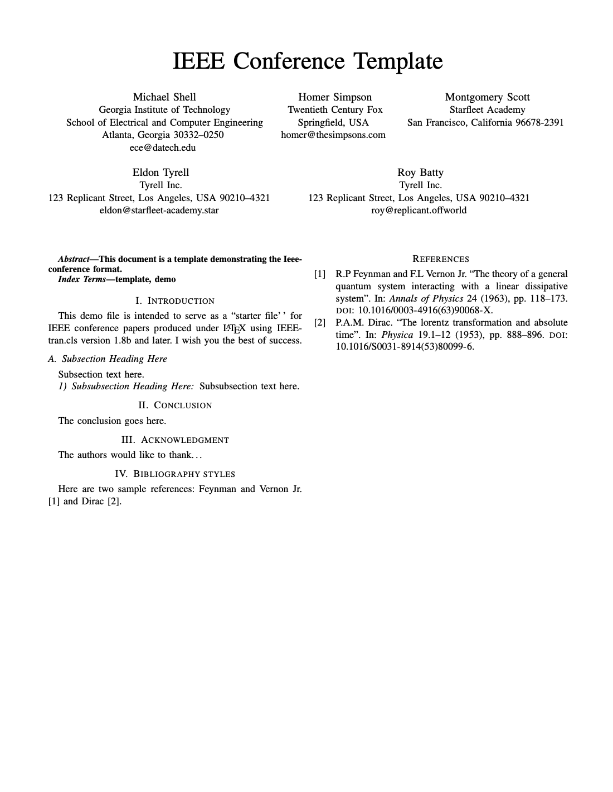

# IEEE Transactions Conference Template

Built on top of the template in [`rticles::ieee_article()`](https://pkgs.rstudio.com/rticles/reference/ieee_article.html).

## Creating a New Article

To create a new article using this format:

```bash
quarto use template jansim/ieee-conference
```

This will create a new directory with an example document that uses this format.

## Using with an Existing Document

To add this format to an existing document:

```bash
quarto add jansim/ieee-conference
```

Then, add the format to your document options:

```yaml
format:
  ieee-conference-pdf: default
```    

## Options

Refer to comments in [ieee-conference.qmd](ieee-conference.qmd) regarding available options. To see how options affect the output, see the [template.tex](_extensions/ieee-conference/template.tex) file.

## Example

[](ieee-conference.pdf)

Here is the source code for a minimal sample document: [ieee-conference.qmd](ieee-conference.qmd) and the rendered output: [ieee-conference.pdf](ieee-conference.pdf).
